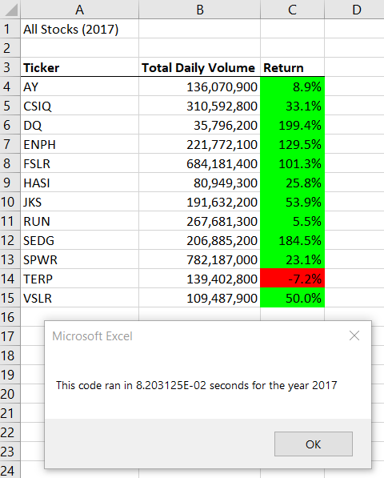
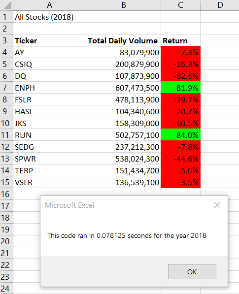

# Finding the Green, Data Analysis on Green Stocks 

## Project Overview

### Purpose and Background
* Reveal trends/strategies for starting a successful Kickstarter Theater campaign.
* Focus of the analysis will be on 1) Outcomes based on launch date of theater campaign and 2) Outcomes based on theater campaign funding goals
* Analysis conducted with use of Microsoft Excel.

## Results
* Comparisons between 2017 and 2018 
* Comparisons beween Original script and refactored script (execution times)

## Conclusion: Pros and Cons of Refactoring Code
* What are...? 
* How do the pros and cons apply...?
